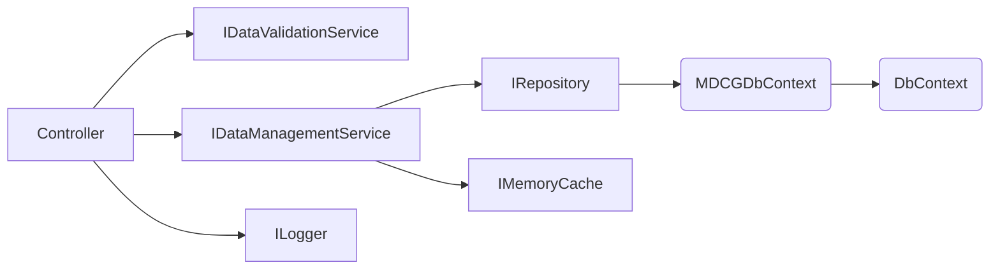

# MDCG

### Market Data Contribution Gateway

MDCG is a RESTful .net core webapi implmementation for allowing recording and retrieval of market-data contributions. It uses .netcore6, entity-framework and sql-server for its implmentation.

---
## Implmentation details

The heirarchial composition of injectable/replacable dependencies in the implementation are as per below.



---

To run the solution, please follow the following steps:
- Checkout code from the [github repo for MDCG](https://github.com/Jay-Dee/MDCG)
- Build the solution locally
- In package-manager console, run the following to generate the local SQL Server db
  ```powershell
  Add-Migration Baseline
  Update-Database
  ```
 -Run the solution. This should launch the SwaggerUI configured for DEV mode shown below
 
 
 
 
 


